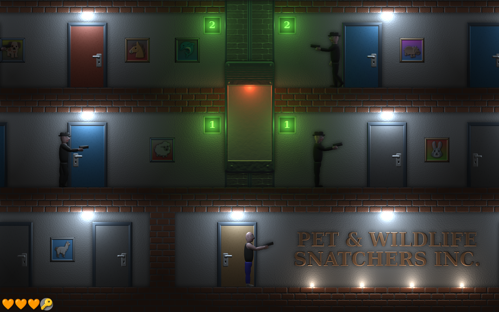

# They took my cat

An [entry to the JS13K 2025](https://js13kgames.com/2025/games/they-took-my-cat) competition, inspired by the classic arcade game [Elevator Action](https://en.wikipedia.org/wiki/Elevator_Action).

An evil society of animal snatchers stole your cat! Search their headquarters for Manny the cat and fight animal thieves along the way.

A complete playthrough takes ~15-20 minutes.

Desktop browsers only. Tested to work in Firefox, Chromium, and WebKitGTK. Performs best in Firefox.

Safari and other browsers are untested.

## Controls

Move around using arrow keys/WASD: 
Left/right to walk/turn 
Down to crouch 
Up/down to use doors and stairs, and control elevators 
Space/X to shoot 

# Technical

The game generates ~730 images and animations, several sound effects, and ~4 minutes of music at load time.

Rendering is done with WebGL2. A simple deferred shading approach is used to render the world, which contains ~160 dynamic light sources.

## Not for redistribution

The source code is provided for educational purposes only.
